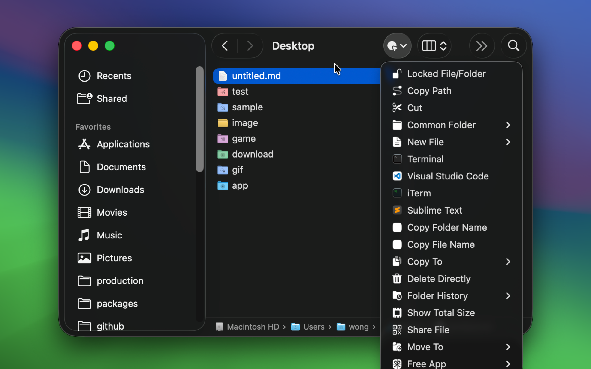
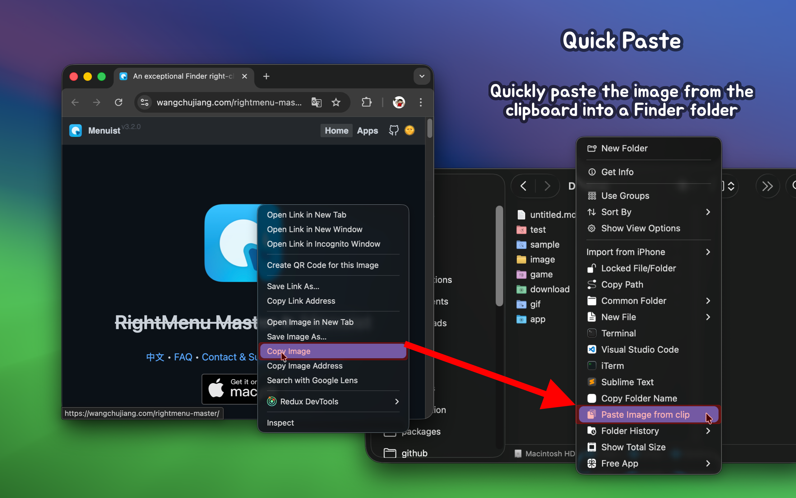

<!--idoc:ignore:start-->
> [!TIP]
> Statement: This project is not open-source. This repository serves as the official website for collecting issues and user feedback. This approach is purely to save costs, as the app cannot pass the review without an official website.
<!--idoc:ignore:end-->

<div align="center">
  <br />
  <br />
  <a href="https://wangchujiang.com/rightmenu-master/">
  
  </a>
  <h1>
    <del>RightMenu Master</del> ▶ <span>Menuist</span>
  </h1>
  <!--rehype:style=border: 0;-->
  <p>
    <a href="./README.zh.md">中文</a> • 
		<a href="#frequently-asked-questions">FAQ</a> • 
    <a target="_blank" href="https://github.com/jaywcjlove/rightmenu-master/issues/new?template=bug_report.yml">Contact & Support</a> • 
    <a href="./CHANGELOG.md">Changelog</a>
  </p>
  <p>
    <a target="_blank" href="https://apps.apple.com/app/menuist/6737160756" title="Menuist for macOS">
      
    </a>
  </p>
</div>

<div align="center">

minimum OS requirement: `macOS 14.0`

</div>

> [!IMPORTANT]
> 
> Based on user feedback that the original app name ~~RightMenu Master~~ was not ideal, I used AI to generate several name candidates and held a vote. As a result, the app name will be changed to **`Menuist`** starting from version 3.0.

**Menuist** is a powerful Finder right-click menu enhancement tool designed to improve the efficiency of Mac users. It not only extends the functionality of the right-click menu but also offers menu bar favorites navigation for more convenient file management. Whether it’s creating new files, quickly previewing code, copying file paths, or sharing files via QR code, Menuist makes it easy. The built-in features like quick access to frequently used folders and folder history make navigating files and folders faster. Additionally, useful features like quick delete, paste images, and folder icon color customization make operations more flexible and efficient. Whether for everyday tasks or development work, Menuist provides great convenience.


## A Must-Have Application for Mac Users!

Menuist is a highly configurable Finder extension that adds powerful functionality to the right-click menu and toolbar in Finder. It allows for quicker and more convenient operations such as moving and copying files, as well as creating new documents. The application also comes with several practical preset operations, further enhancing your work efficiency.








## Main Features

- **Create New File**: Easily create new files in specific formats and upload custom templates.
- **Quick Preview with Code Highlighting**: Support for quick preview of code files with syntax highlighting.
- **File QR Code Sharing**: Quickly share files via QR code and local network links.
- **Frequently Used Folders**: Customize frequently used folders for quick access or to create new terminal windows.
- **Website Navigation**：Supports setting frequently used folders as [website navigation](https://github.com/jaywcjlove/bookmarks).
- **Folder Access History**: Record and quickly access the history paths of folders.
- **Common Applications**: Quickly open commonly used editors or command line tools (Terminal/iTerm).
- **Common Scripts**: You can create custom scripts and add them to the right-click menu.
- **Copy Functions**: Provide various copy functions to simplify file path and name management.
- **Copy File Path**: Quickly copy the absolute path of a file.
- **Copy Folder/File Name**: Support quick copying of folder or file names.
- **Quick Paste**: Support quickly pasting images into Finder folders.
- **Direct Delete**: Quickly delete files or folders to simplify operations.
- **Recognize and Add "Open Remote Git URL" Menu**: Automatically detect and add a menu to open the remote URL of Git repositories.
- **Show Total Size**: Display the total size and individual sizes of selected multiple files or folders.
- **Set Folder Icon Color**: Quickly change or customize the color of folder icons.
- **Cut and Paste Menu**: Cut(⌘X) and paste(⌘V) functions to enhance file operation flexibility.
- **Create Desktop Shortcut**: Send files to the desktop as symbolic links (shortcuts).
- **Menu Bar Quick Navigation**: Quickly access frequently used folders and applications through the menu bar to enhance operational efficiency.
- **Copy To**: Allow quick copying of files or folders to a specified location.
- **Move To**: Allow quick moving of files or folders to a specified location.
- **Convert To**: Provide image format conversion functions.
- **Create icns Icon**: Support quick navigation for creating icns icon files.
- **File/Folder Locked**: Quickly lock files or folders via menu shortcut only

## Frequently Asked Questions

### Finder Extension Partial Menu Not Displaying Issue

When permissions are passively confirmed and then denied, reauthorizing permissions may cause the menu to not display. In this case, you need to restart the Finder extension. Restarting the computer can achieve this, but it’s cumbersome. Here are two simpler methods:

- Method 1: Execute `killall Finder` in the command line to restart Finder.  
- Method 2: Use the system’s `Force Quit Applications` feature to reload Finder. Open the `Force Quit Applications` window using the shortcut <kbd>⌘</kbd><kbd>⌥</kbd><kbd>esc</kbd>, find the `Finder` application, and click the `Relaunch` button below.

### Frequent Authorization Prompts

In the app settings, under `Folder Authorization` -> `Add Folder`, try adding the root directory to avoid frequent authorization prompts.

### Reauthorization After Restart

Here is Apple's security policy for Finder extensions. Initially, I thought granting `Full Disk Access` would solve the problem, but I found that it doesn't work. Even with `Full Disk Access` enabled, we still need to manually select the directory and grant permissions in Finder. This process is very cumbersome for personal use, and since App Store submission requires compliance with sandbox security policies, I have not yet found a better solution.

### How to Set Up Website Shortcuts?

You can refer to our [Menuist Bookmarks](https://github.com/jaywcjlove/bookmarks) repository as an example. Simply add the example to your frequently used folders to quickly enable website shortcuts. You can also follow the documentation to add and manage your own bookmarks.


### Enable Finder Extension

If you are prompted to enable the plugin, you can run the following command in the terminal to enable the Finder extension. This issue is caused by a bug in macOS 15+ where the settings interface disappeared. It has been [fixed](https://forums.developer.apple.com/forums/thread/756711?answerId=812519022#812519022) in macOS 15.2.

```shell
pluginkit -e use -i com.wangchujiang.rightmenu-master.sync \
  && osascript -e 'quit app id "com.wangchujiang.rightmenu-master"' \
  && osascript -e 'tell application id "com.wangchujiang.rightmenu-master" to activate'
```

<!--idoc:config:
title: An exceptional Finder right-click menu enhancement tool that makes your right-click menu more powerful.
keywords: RightMenu, Finder, macOS, application, file management, create new file, copy functionality, enhancement tool
-->