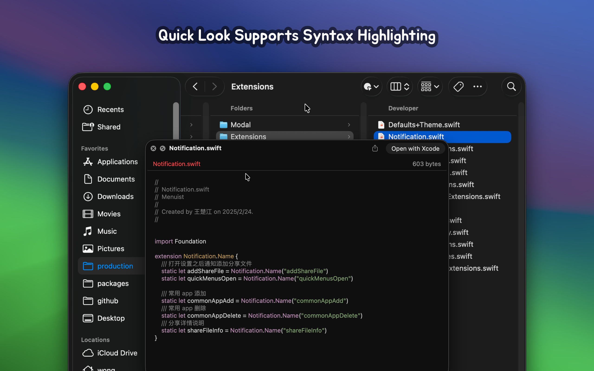

   
   
  
  <h1>RightMenu Master</h1>
  <!--rehype:style=border: 0;-->
  

    <a href="./README.zh.md">中文</a> • 
		<a href="#frequently-asked-questions">FAQ</a> • 
    <a target="_blank" href="https://github.com/jaywcjlove/rightmenu-master/issues/new?assignees=&labels=support%2Cfeedback%2Cquestion&projects=&template=bug_report.yml&title=%F0%9F%99%8B%E2%80%8D%E2%99%82%EF%B8%8F+Support+%26+Feedback%3A+RightMenu+Master">Contact & Support</a>
  

  

    
  

minimum OS requirement: `macOS 14.0`

RightMenu Master — An exceptional Finder right-click menu enhancement tool that makes your right-click menu more powerful.

### A Must-Have Application for Mac Users!

RightMenu Master is a highly configurable Finder extension that adds powerful functionality to the right-click menu and toolbar in Finder. It allows for quicker and more convenient operations such as moving and copying files, as well as creating new documents. The application also comes with several practical preset operations, further enhancing your work efficiency.

### Key Features

**■ Create New File**

Finder lacks an easy way to create new files in specific formats. RightMenu Master simplifies this, allowing you to create files with just one or two clicks. You can also upload custom templates to create files in specific formats, boosting your productivity.

**■ Copy Functionality**

RightMenu Master offers a variety of copy options to make file management more convenient. You can quickly copy the full file path, file name, or folder name, or even duplicate files and folders, greatly enhancing flexibility and efficiency.

**■ Copy File Path**

Quickly obtain the absolute path of a file for easy reference in other applications, without the need for tedious manual navigation.

**■ Copy Folder/File Name**

Easily copy the folder or file name to the clipboard, facilitating quick sharing and reference of names.

**■ Direct Delete**

With RightMenu Master, you can directly delete files or folders, eliminating multiple steps in Finder and making deletion faster and more convenient.

## Frequently Asked Questions

### Finder Extension Partial Menu Not Displaying Issue

When permissions are passively confirmed and then denied, reauthorizing permissions may cause the menu to not display. In this case, you need to restart the Finder extension. Restarting the computer can achieve this, but it’s cumbersome. Here are two simpler methods:

- Method 1: Execute `killall Finder` in the command line to restart Finder.  
- Method 2: Use the system’s `Force Quit Applications` feature to reload Finder. Open the `Force Quit Applications` window using the shortcut <kbd>⌘</kbd><kbd>⌥</kbd><kbd>esc</kbd>, find the `Finder` application, and click the `Relaunch` button below.

### Frequent Authorization Pop-Up Issues

In the application settings, go to `General` -> `Full Disk Access` -> Click to `Grant` to add the application to the `Full Disk Access` list.

<!--idoc:config:
site: RightMenu Master
title: An exceptional Finder right-click menu enhancement tool that makes your right-click menu more powerful.
keywords: RightMenu, Finder, macOS, application, file management, create new file, copy functionality, enhancement tool
-->