<!--idoc:ignore:start-->
> [!TIP]
> 声明：此项目并非开源，仓库作为官方网站，用于收集问题和用户需求。这样做是为了节省成本，因为没有官网，应用无法通过审核。
<!--idoc:ignore:end-->

<div align="center">
  <br />
  <br />
  
  <h1>
    <del>RightMenu Master</del> ▶ <span>Menuist</span>
  </h1>
  <!--rehype:style=border: 0;-->
  <p>
    <a href="./README.md">English</a> • 
    <a href="#国际化支持">国际化支持</a> • 
		<a href="#常见问题解答">常见问题</a> • 
    <a target="_blank" href="https://github.com/jaywcjlove/rightmenu-master/issues/new?template=bug_report_cn.yml">联系&支持</a> • 
    <a href="./CHANGELOG.zh.md">更新日志</a>
  </p>
  <p>
    <a target="_blank" href="https://jaywcjlove.github.io/maslink/?id=6737160756" title="PasteQuick for macOS">
      
    </a>
  </p>
</div>

<div align="center">

最低操作系统要求：`macOS 14.0`

</div>

> [!IMPORTANT]
> 
> 根据用户反馈认为原应用名称 ~~RightMenu Master~~ 不够理想，我使用 AI 生成了多个候选名称并发起投票，最终决定从 3.0 版本起将应用名称更改为 **`Menuist`**。

**Menuist** 是一款强大的 Finder 右键菜单增强工具，专为提升 Mac 用户的操作效率而设计。它不仅扩展了右键菜单的功能，还提供了菜单栏收藏导航，让文件管理更加便捷。无论是创建新文件、快速预览代码、复制文件路径，还是通过二维码分享文件，Menuist 都能帮你轻松完成。内置的常用文件夹和文件夹历史记录功能，使得文件和文件夹的访问更加迅速。而像快速删除、快捷粘贴、文件夹图标颜色自定义等实用功能，更是让操作更加灵活高效。无论是日常办公还是开发工作，Menuist 都能为你提供极大的便利。

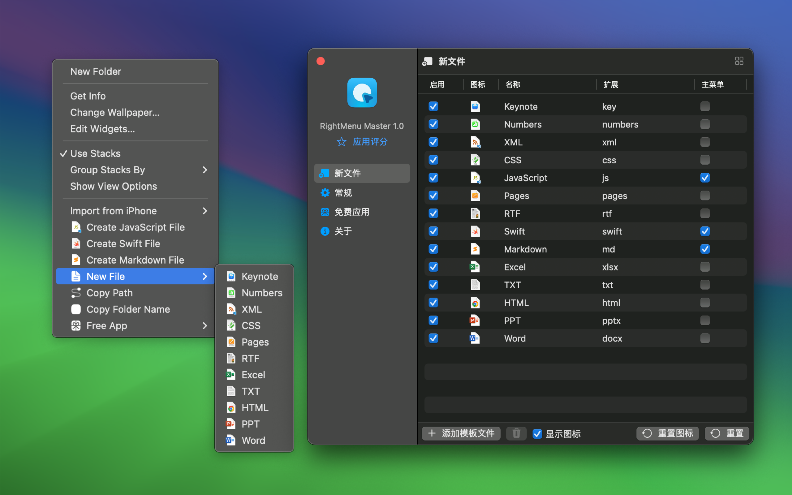

## Mac 用户必备应用！

Menuist 是一款高度可配置的 Finder 扩展，能够为 Finder 的右键菜单和工具栏添加强大的操作功能。它让移动和复制文件、创建新文档等操作更加快捷、方便。应用还内置了多个实用的预设操作，进一步提升您的工作效率。

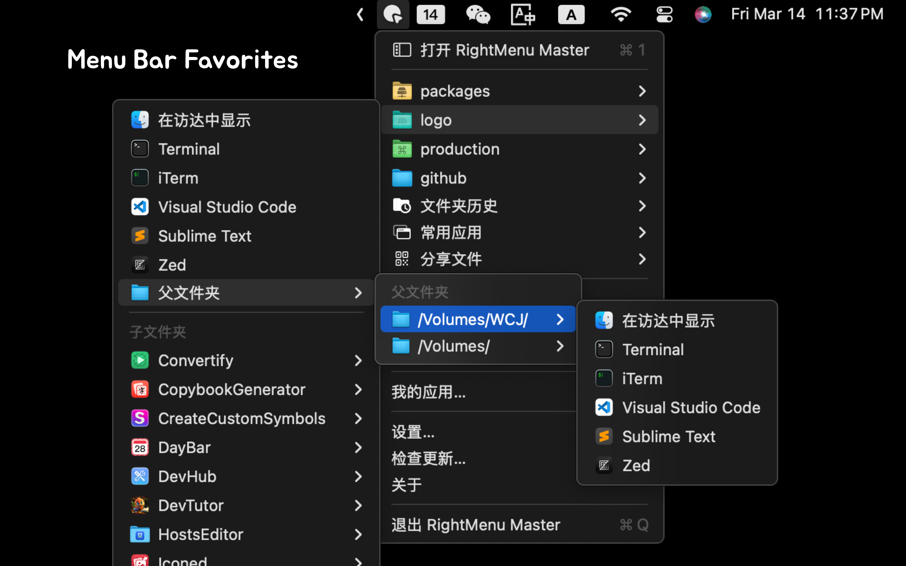

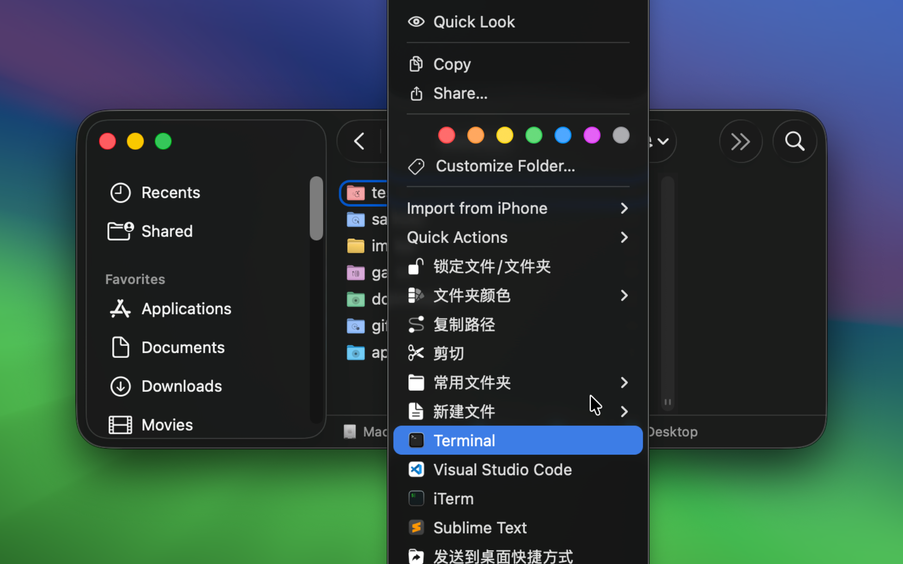

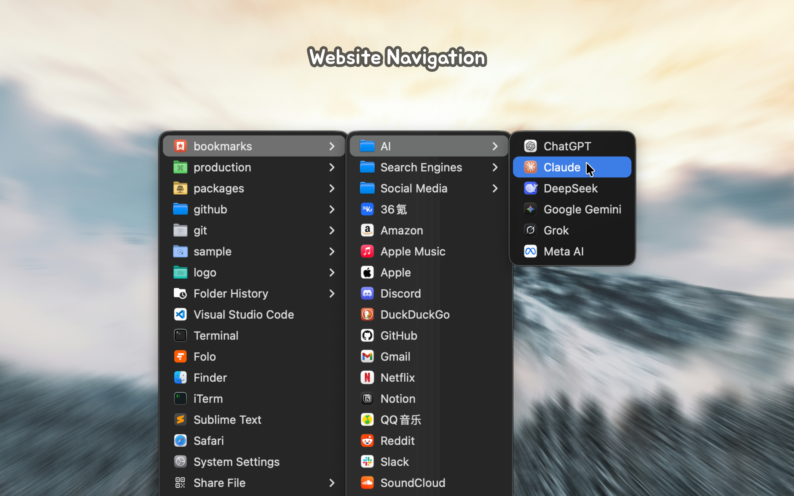

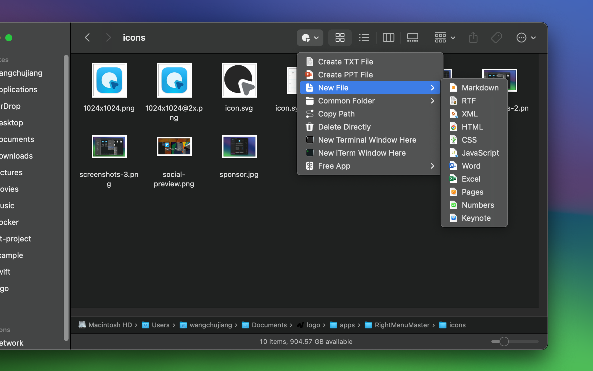

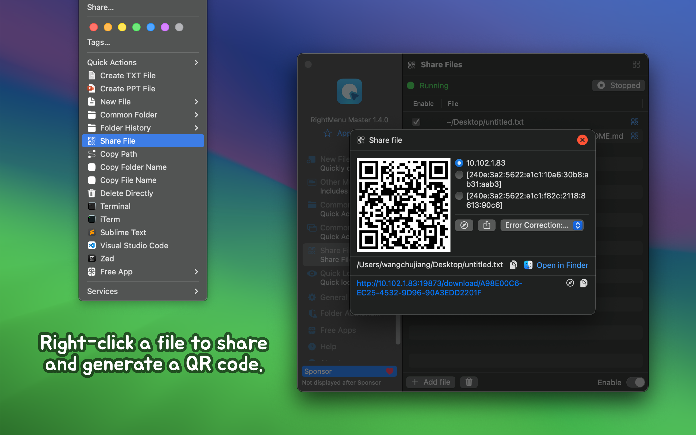

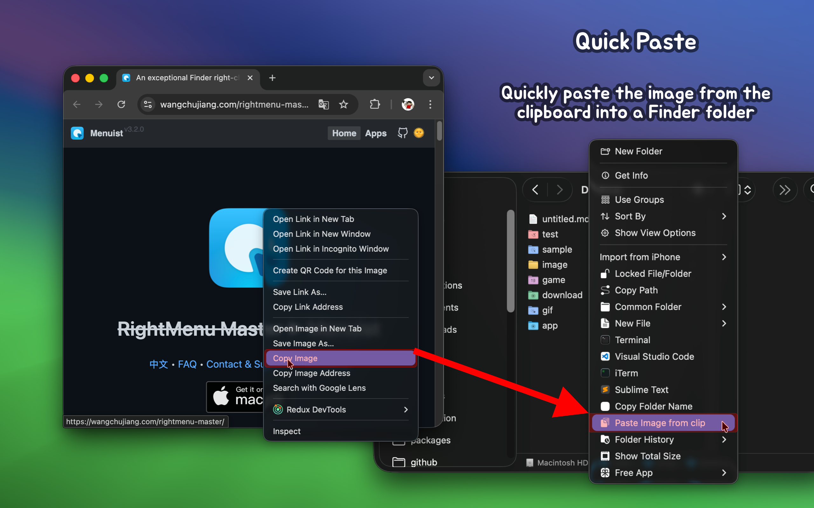

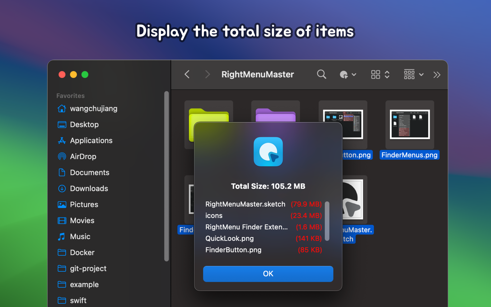

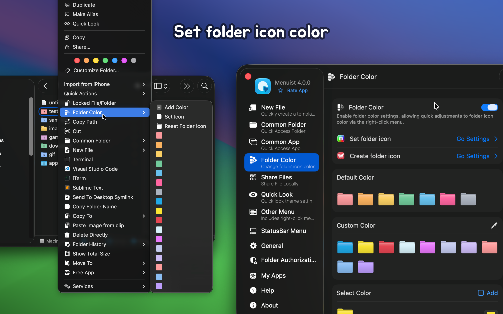

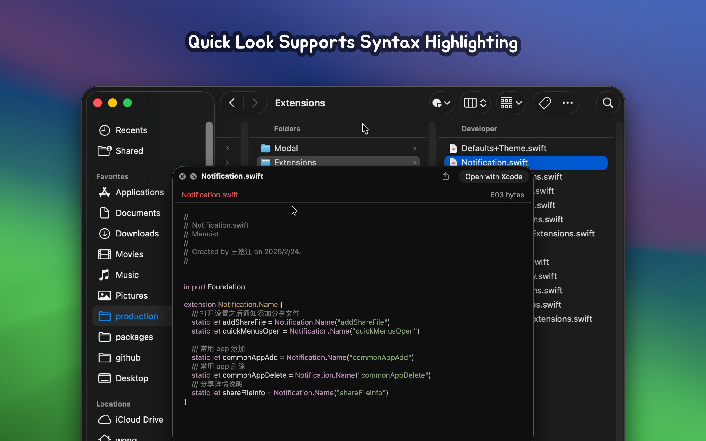

## 主要功能

- **菜单栏快捷导航**：通过菜单栏快速访问常用文件夹与应用，提升操作效率
- **新建文件**：一键创建指定格式文件，可导入自定义模板
- **文件二维码分享**：生成二维码与局域网链接，快速分享文件
- **常用文件夹**：自定义常用目录，一键直达或新建终端窗口
- **网站导航**：支持将常用文件夹设置为[网站导航](https://github.com/jaywcjlove/bookmarks)。
- **文件夹访问历史**：记录文件夹打开路径，可快速回溯访问
- **常用程序**：快速启动编辑器、终端/iTerm等常用命令行工具
- **自定义脚本**：编写自定义脚本并添加至右键菜单
- **复制工具集**：多项复制功能，便捷管理文件路径与名称
- **复制文件路径**：一键复制文件绝对路径
- **复制文件夹/文件名**：快速复制目录或文件名称
- **快捷粘贴图片**：直接将图片粘贴到访达文件夹内
- **直接删除**：快速移除文件/文件夹，简化操作步骤
- **识别 Git 远程链接菜单**：自动识别仓库并添加打开远程Git地址选项
- **显示选中项大小**：批量选中文件/文件夹，展示总占用体积与分项大小
- **自定义文件夹图标颜色**：一键修改、自定义文件夹图标配色
- **剪切粘贴功能**：支持⌘X剪切、⌘V粘贴，丰富文件操作方式
- **创建桌面替身**：生成软链接快捷方式发送至桌面
- **复制到指定位置**：将文件/文件夹快速复制至目标路径
- **移动到指定位置**：将文件/文件夹快速剪切移动至目标路径
- **图片格式转换**：提供多种图像格式互转功能
- **生成icns图标**：快捷引导制作icns图标文件
- **文件/文件夹锁定**：通过菜单快捷键快速锁定项目防止修改
- **应用程序快速预览**：为App程序文件添加QuickLook预览支持
- **代码高亮预览**：代码文件预览时自带语法高亮显示
- **新增预览插件**：支持Icon Composer .icon格式文件快速预览
- **外接磁盘展示**：在状态栏菜单栏自动挂载并显示外接存储设备

## 常见问题解答

### Finder 扩展部分菜单不显示问题

在被动确认权限，如果拒绝了，再重新授权权限，这时菜单不显示，需要重启 Finder 扩展，可以通过重启电脑来重启插件，这样比较繁琐，有两个比较简单的方法：

- 方法1：在命令行中执行 `killall Finder` 重启 Finder  
- 方法2：通过系统的 `强制退出应用` 功能，重新加载 Finder，通过 <kbd>⌘</kbd><kbd>⌥</kbd><kbd>esc</kbd> 快捷键打开`强制退出应用`界面，找到 Finder 应用，点击下面 `Relaunch` 按钮。

### 频繁弹出授权问题

在应用设置中 `文件夹授权` -> `添加文件夹`，尽量添加根目录，将不会频繁弹出授权问题。

### 重启需要重新授权

这是 Apple 针对 Finder 扩展的安全策略。最初，我认为授予 `完整磁盘访问` 权限可以解决问题，但实际发现并没有效果。即使启用了 `完整磁盘访问`，我们仍然需要在 Finder 中手动选择目录并授予权限。这个过程在个人使用中非常麻烦，而由于 App Store 提交要求遵守沙箱安全策略，至今我还没有找到更好的解决方案。

### 如何设置网站导航？

你可以参考我们的 [Menuist 书签](https://github.com/jaywcjlove/bookmarks) 仓库示例，只需将示例添加到常用文件夹中，即可快速实现网站导航功能。同时，你也可以根据文档说明，自行添加和管理自己的书签。

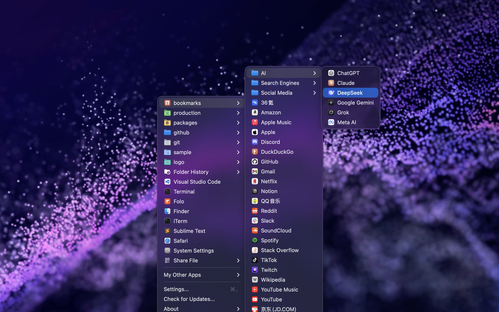

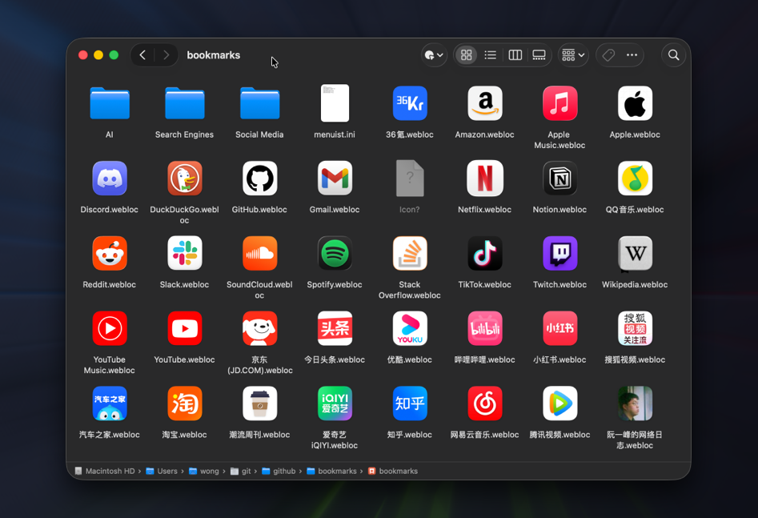

### 启用 Finder 扩展

如果提示需要启用插件，您可以在命令行中运行以下命令来启用 Finder 扩展。这是由于 macOS 15+ 存在一个设置界面消失的 bug，已在 macOS 15.2 中[修复](https://forums.developer.apple.com/forums/thread/756711?answerId=812519022#812519022)。

```shell
pluginkit -e use -i com.wangchujiang.rightmenu-master.sync \
  && osascript -e 'quit app id "com.wangchujiang.rightmenu-master"' \
  && osascript -e 'tell application id "com.wangchujiang.rightmenu-master" to activate'
```

### 国际化支持

Menuist 的国际化文件放置在 [`@jaywcjlove/app-i18n/lproj/menuist`](https://github.com/jaywcjlove/app-i18n/tree/main/i18n/lproj/menuist/) 集中维护，欢迎添加自己相关语言文件

https://wangchujiang.com/app-i18n/menuist.html

<!--idoc:config:
title: Menuist
keywords: RightMenu,RightMenu Master,右键菜单,Finder,macOS,应用,文件管理,创建新文件,复制功能,增强工具
description: 卓越的 Finder 右键菜单增强工具，让您的右键菜单更加强大。
-->