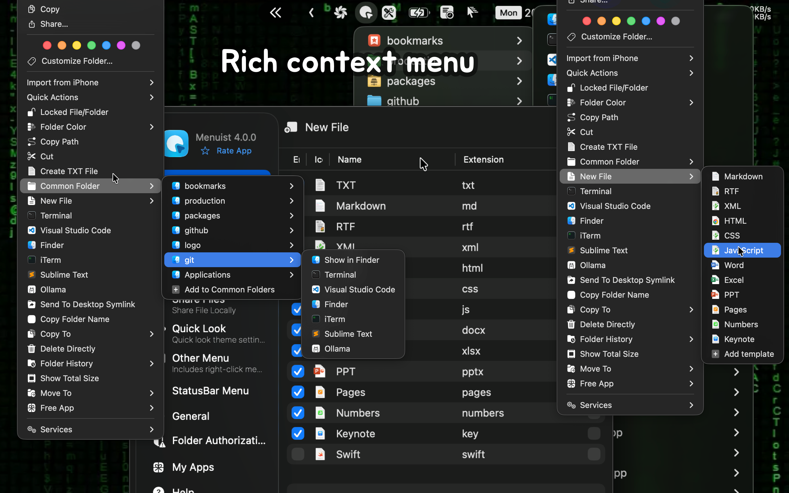

<div align="center">
  <br />
  <br />
  
  <h1>RightMenu Master</h1>
  <!--rehype:style=border: 0;-->
  <p>
    <a href="./README.md">English</a> • 
		<a href="#常见问题解答">常见问题</a> • 
    <a target="_blank" href="https://github.com/jaywcjlove/rightmenu-master/issues/new?assignees=&labels=support%2Cfeedback%2Cquestion&projects=&template=bug_report.yml&title=%F0%9F%99%8B%E2%80%8D%E2%99%82%EF%B8%8F+Support+%26+Feedback%3A+Quick+RSS">联系&支持</a>
  </p>
  <p>
    <a target="_blank" href="https://apps.apple.com/app/rightmenu-master/6737160756" title="PasteQuick for macOS">
      
    </a>
  </p>
</div>

<div align="center">

最低操作系统要求：`macOS 14.0`

</div>

RightMenu Master —— 卓越的 Finder 右键菜单增强工具，让您的右键菜单更加强大。



### Mac 用户必备应用！

RightMenu Master 是一款高度可配置的 Finder 扩展，能够为 Finder 的右键菜单和工具栏添加强大的操作功能。它让移动和复制文件、创建新文档等操作更加快捷、方便。应用还内置了多个实用的预设操作，进一步提升您的工作效率。


### 主要功能

**■ 创建新文件**

Finder 缺乏便捷的方式来创建特定格式的新文件，而 RightMenu Master 可以轻松实现这一点，只需点击一次或两次即可创建文件。此外，您可以上传自定义模板，通过模板创建特定格式的新文件，提高效率。


**■ 快速预览支持代码高亮**


提供了一种快速查看扩展，可用于预览带有语法高亮的源文本文件。该扩展通过[统一类型标识符 (UTI)](https://developer.apple.com/library/archive/documentation/FileManagement/Conceptual/understanding_utis/understand_utis_intro/understand_utis_intro.html) 来处理支持的文件格式，而不仅仅依赖于文件扩展名。在 UTI 的定义中包含了与其关联的文件扩展名和 MIME 类型列表。

**■ 常用文件夹**

支持自定义常用文件夹，可快速访问目录或在指定文件夹中直接新建终端窗口。

**■ 常用应用**

支持各类编辑器和命令行工具（Terminal/iTerm ）快速打开当前目录，提升操作效率

**■ 复制功能**

RightMenu Master 提供了多样的复制功能，让文件操作更加便捷。您可以快速复制完整文件路径、文件名、文件夹名，或直接复制文件/文件夹，大幅提升文件管理的灵活性和效率。

**■ 复制文件路径**

快速获取文件的绝对路径，便于在其他应用中直接引用，无需繁琐的手动操作。

**■ 拷贝文件夹/文件名**

支持复制文件夹名称或文件名称到剪贴板，便于文件名的快速传输与引用。

**■ 直接删除**

通过 RightMenu Master，您可以直接删除文件或文件夹，省去 Finder 中的多步操作，使删除操作更加高效便捷。

## 常见问题解答

### Finder 扩展部分菜单不显示问题

在被动确认权限，如果拒绝了，再重新授权权限，这时菜单不显示，需要重启 Finder 扩展，可以通过重启电脑来重启插件，这样比较繁琐，有两个比较简单的方法：

- 方法1：在命令行中执行 `killall Finder` 重启 Finder  
- 方法2：通过系统的 `强制退出应用` 功能，重新加载 Finder，通过 <kbd>⌘</kbd><kbd>⌥</kbd><kbd>esc</kbd> 快捷键打开`强制退出应用`界面，找到 Finder 应用，点击下面 `Relaunch` 按钮。

### 频繁弹出授权问题

在应用设置用 `常规` -> `完全磁盘访问` -> 点击 `授权` 将应用添加到 `完全磁盘访问` 列表中

### 启用 Finder 扩展

如果提示您需要启用插件，你需要在命令行中运行下面命令来启用 Finder 扩展。

```shell
pluginkit -e use -i com.wangchujiang.rightmenu-master.sync \
  && osascript -e 'quit app id "com.wangchujiang.rightmenu-master"' \
  && osascript -e 'tell application id "com.wangchujiang.rightmenu-master" to activate'
```

<!--idoc:config:
site: RightMenu Master
title: 卓越的 Finder 右键菜单增强工具，让您的右键菜单更加强大。
keywords: RightMenu,右键菜单,Finder,macOS,应用,文件管理,创建新文件,复制功能,增强工具
-->