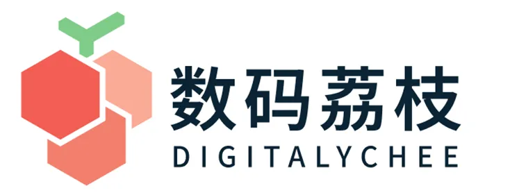

       
    
    <h2>授权证明</h2>
    <!--rehype:style=border: 0;padding-bottom: 0;margin-bottom: 0;-->
Authorization Certificate  

<b>小弟调调</b> 授权「数码荔枝」为大中国区官方合作伙伴 
We authorize DIGITALYCHEE as our official partner in China

<b>负责以下软件在中国的销售事宜</b> 
Responsible for the sales of the following product(s)  
<b>Menuist</b>  
<b>该合作伙伴的销售渠道</b> 
Authorized Sales Channels

<a href="https://lizhi.shop/" target="_blank">lizhi.shop</a> / <a href="https://digitalychee.taobao.com/" target="_blank">digitalychee.taobao.com</a>

